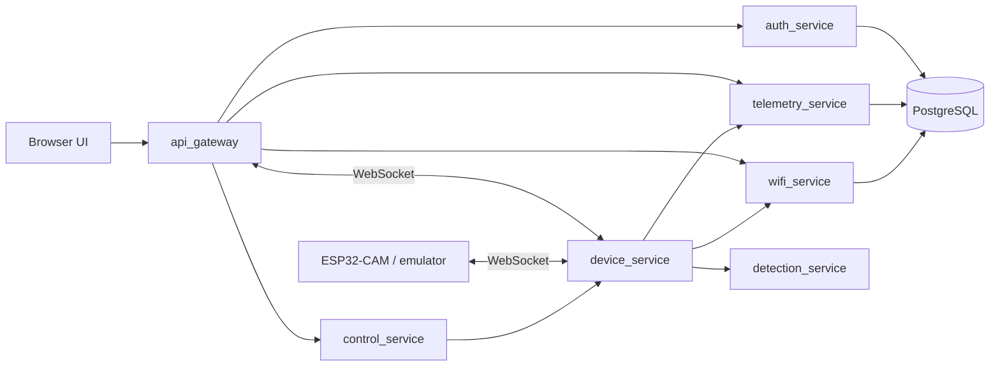

# BPNA Microservices Architecture

Система БПНА организована как набор отдельных сервисов с единым gateway для UI и API.

## Сервисы

| Service | Назначение | Port |
| --- | --- | --- |
| `api_gateway` | Входная точка для браузера, static UI, HTTP/WS proxy | `8000` |
| `auth_service` | Пользователи, логин, JWT, проверка токенов | `8001` |
| `telemetry_service` | Прием, хранение, история и экспорт телеметрии | `8002` |
| `device_service` | WebSocket устройства, видео, состояние борта, отправка команд | `8003` |
| `control_service` | REST API ручного управления | `8004` |
| `wifi_service` | Wi-Fi measurements, heatmap, сканирование и карты | `8005` |
| `detection_service` | YOLO inference как отдельный ML-сервис | `8006` |

## Потоки данных



## Почему так

- `auth_service` изолирует аутентификацию и JWT.
- `device_service` держит живое соединение с устройством и видеопоток.
- `control_service` принимает команды интерфейса и отправляет их устройству.
- `telemetry_service` отвечает за историю, выдачу и экспорт телеметрии.
- `wifi_service` владеет Wi-Fi картой и процессом сканирования.
- `detection_service` вынесен отдельно из-за тяжелых ML-зависимостей.
- `api_gateway` сохраняет для frontend единый адрес и привычные `/api/...` и `/ws/...` маршруты.

## Запуск

```powershell
docker compose -f docker-compose.microservices.yml up --build
```

## Основные URL

- UI: `http://localhost:8000/`
- Gateway health: `http://localhost:8000/health`
- Auth service: `http://localhost:8001/docs`
- Telemetry service: `http://localhost:8002/docs`
- Device service: `http://localhost:8003/docs`
- Control service: `http://localhost:8004/docs`
- Wi-Fi service: `http://localhost:8005/docs`
- Detection service: `http://localhost:8006/docs`
